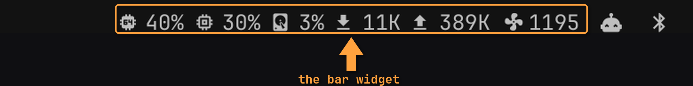
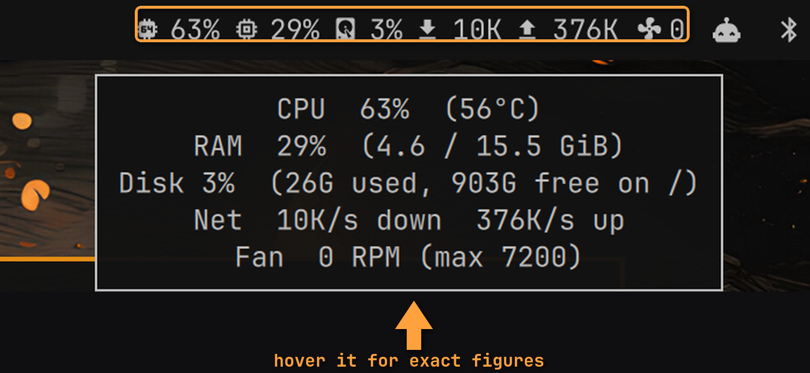
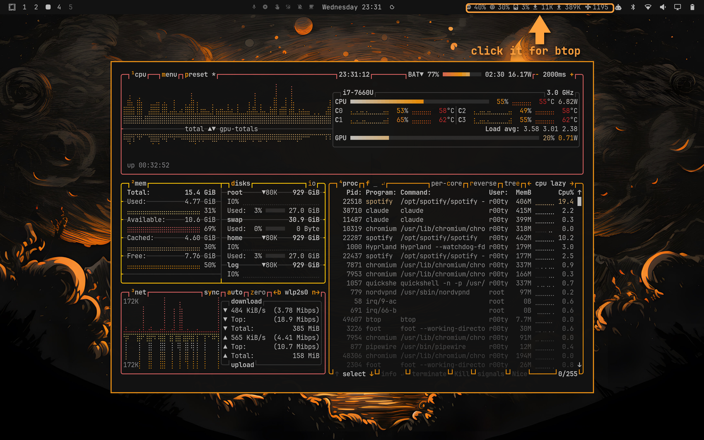

# omarchy-menu-sysmon

**System monitor bar widget for [Omarchy](https://omarchy.org/).** Live CPU, RAM,
disk, network throughput, fan RPM and CPU temperature in the Omarchy status bar —
read straight from `/proc` and `/sys`, with no daemon, no polling service and no
dependencies beyond the coreutils you already have.



```
󰻠 18%  󰍛 29%  󰋊 3%  󰇚 2K 󰕒 131B  󰈐 0
 CPU     RAM    disk   down  up      fan
```

Hover for a detail tooltip with exact figures, real byte counts and CPU
temperature — the bar rounds, the tooltip does not:



Click to open `btop`. Colors come from the active Omarchy theme, so the widget
and its tooltip re-theme with everything else:



## Install

```bash
omarchy plugin add https://github.com/rfaile313/omarchy-menu-sysmon.git --enable --yes
omarchy bar move rfaile313.menu-sysmon --section right --index 0
```

That is the whole install. The widget appears immediately — the Omarchy shell
hot-reloads plugins, so no restart or logout is needed.

To remove it:

```bash
omarchy plugin remove rfaile313.menu-sysmon --yes
```

## What it shows

| Field  | Source | Notes |
|--------|--------|-------|
| `cpu`  | `/proc/stat` | True busy percentage sampled across the refresh interval, not load average |
| `ram`  | `/proc/meminfo` | Based on `MemAvailable`, so cache and reclaimable memory are not counted as used |
| `disk` | `df /` | Root filesystem usage |
| `net`  | `/sys/class/net/*/statistics` | Combined throughput of every physical interface, loopback excluded |
| `fan`  | `applesmc` platform path, else any `hwmon` fan | RPM of the fastest-spinning fan, when the hardware exposes one |
| temp   | `coretemp`, `k10temp`, `zenpower`, `cpu_thermal`, `acpitz`, else `thermal_zone` | CPU temperature, tooltip only |

### Hardware support

Every source is probed, never assumed, so the same script runs on Intel, AMD
and ARM. A field with no backing hardware disappears from the bar rather than
showing a zero or an error: on a fanless machine the fan glyph is simply absent,
and a box with no readable sensor shows no temperature in the tooltip.

Temperature falls back through Intel (`coretemp`), AMD (`k10temp`, `zenpower`),
ARM and SoC (`cpu_thermal`), generic ACPI (`acpitz`), and finally the kernel's
own `thermal_zone` entries. Readings outside 1–150 °C are discarded rather than
printed. On a multi-fan desktop the fastest-spinning fan is reported, since that
is the one responding to load.

Apple hardware needs a special case: `applesmc` registers an hwmon node that
contains no `fan*_input`, so its fan is only readable from the platform path.
This widget checks `/sys/devices/platform/applesmc.*/fan1_input` before the
generic hwmon glob, which is why it reports fan RPM on MacBooks where other bar
widgets show nothing.

## Configuration

Set options with `omarchy bar set`, or edit the widget entry in
`~/.config/omarchy/shell.json`. Changes hot-reload on save.

| Key | Default | What it does |
|-----|---------|--------------|
| `fields` | `cpu,ram,disk,net,fan` | Which metrics to show, and in what order |
| `interval` | `3` | Seconds between samples; CPU and network rates average over this window |
| `onClick` | `omarchy-launch-or-focus-tui btop` | Command run on left click |
| `onRightClick` | — | Command run on right click |
| `warnThreshold` | `75` | Percentage at which the widget flags itself busy (`+15` for critical) |
| `horizontalMargin` | `4` | Padding either side of the widget, in pixels |
| `fontSize` | `12` | Label size |

Examples:

```bash
# CPU and memory only
omarchy bar set rfaile313.menu-sysmon fields cpu,ram

# Slower refresh
omarchy bar set rfaile313.menu-sysmon interval 5

# Open a different tool on click
omarchy bar set rfaile313.menu-sysmon onClick "omarchy-launch-or-focus-tui htop"
```

## How it works

`Widget.qml` is a `WidgetButton` that runs `bin/menu-sysmon` on a `Timer` and renders
the JSON it prints. `bin/menu-sysmon` is a plain bash script emitting a Waybar-style
object:

```json
{"text":"󰻠 29% 󰍛 29% 󰋊 3%","tooltip":"CPU  29%  (48°C)\n…","class":"normal"}
```

Because the script is the whole data layer, you can run it directly to debug, or
reuse it in Waybar or any other bar that accepts JSON modules:

```bash
~/.config/omarchy/plugins/rfaile313.menu-sysmon/bin/menu-sysmon cpu,ram,net
```

It keeps one small state file per field-set under `$XDG_RUNTIME_DIR` to compute
CPU and network deltas between runs.

## Requirements

Omarchy 4.0 or newer (the Quickshell `omarchy-shell` bar), a Nerd Font for the
glyphs — Omarchy's default JetBrainsMono Nerd Font is fine — and `bash`, `awk`,
`df`, `cksum`. No AUR packages, no Python, no Node.

## Keywords

omarchy, omarchy plugin, omarchy shell, omarchy bar widget, quickshell, hyprland,
system monitor, resource monitor, cpu usage, ram usage, memory usage, disk usage,
network speed, bandwidth monitor, fan speed, rpm, cpu temperature, applesmc,
macbook fan, status bar, waybar alternative, arch linux

## License

MIT — see [LICENSE](LICENSE).
